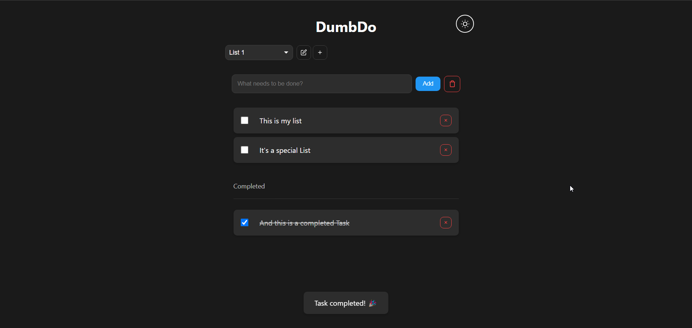

<!--
N.B.: This README was automatically generated by <https://github.com/YunoHost/apps/tree/master/tools/readme_generator>
It shall NOT be edited by hand.
-->

# DumbDo for YunoHost

[](https://ci-apps.yunohost.org/ci/apps/dumbdo/)


[](https://install-app.yunohost.org/?app=dumbdo)

*[Read this README in other languages.](./ALL_README.md)*

> *This package allows you to install DumbDo quickly and simply on a YunoHost server.*  
> *If you don't have YunoHost, please consult [the guide](https://yunohost.org/install) to learn how to install it.*

## Overview

A stupidly simple todo list application that just works. No complex database, no unnecessary features - just todos.

### Features

    ✨ Clean, minimal interface
    🌓 Dark/Light mode with system preference detection
    💾 File-based storage - todos persist between sessions
    📱 Fully responsive design
    🚀 Fast and lightweight
    🔒 PIN protection (4-10 digits if enabled)


**Shipped version:** 1.0.0~ynh1

## Screenshots



## Documentation and resources

- Official app website: <https://www.dumbware.io/>
- Upstream app code repository: <https://github.com/DumbWareio/DumbDo>
- YunoHost Store: <https://apps.yunohost.org/app/dumbdo>
- Report a bug: <https://github.com/YunoHost-Apps/dumbdo_ynh/issues>

## Developer info

Please send your pull request to the [`testing` branch](https://github.com/YunoHost-Apps/dumbdo_ynh/tree/testing).

To try the `testing` branch, please proceed like that:

```bash
sudo yunohost app install https://github.com/YunoHost-Apps/dumbdo_ynh/tree/testing --debug
or
sudo yunohost app upgrade dumbdo -u https://github.com/YunoHost-Apps/dumbdo_ynh/tree/testing --debug
```

**More info regarding app packaging:** <https://yunohost.org/packaging_apps>
